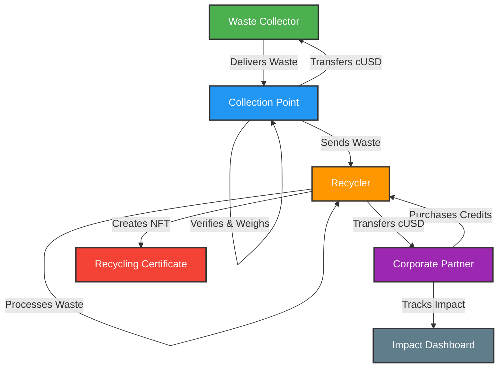

# AfriCycle: A Multi-Stream ReFi Waste Management Ecosystem

## 🌍 Overview
AfriCycle is a blockchain-powered circular economy platform that addresses Africa's waste management crisis across three key waste streams: **plastic**, **electronic waste (e-waste)**, and **metal/general waste**. The platform incentivizes waste collection through **tokenized rewards**, enables **transparent recycling processes**, and promotes **corporate sustainability** through verified **recycling credits**.

## 🔄 System Workflow


### Role-Based Workflow Description

1. **Waste Collector**
   - Delivers waste to collection points
   - Receives cUSD payments based on waste weight and type
   - Can track earnings through their wallet

2. **Collection Point**
   - Verifies and weighs incoming waste
   - Processes cUSD payments to collectors
   - Coordinates waste transfer to recyclers
   - Maintains quality standards

3. **Recycler**
   - Receives waste from collection points
   - Processes waste into recyclable materials
   - Creates NFTs for verified recycling
   - Sells recycling credits to corporate partners
   - Receives cUSD payments for credits

4. **Corporate Partner**
   - Purchases recycling credits using cUSD
   - Tracks environmental impact
   - Monitors sustainability goals
   - Accesses impact dashboard for reporting

### Key Interactions
- All financial transactions use cUSD
- NFTs represent verified recycling certificates
- Smart contracts automate payments and verification
- Impact tracking is transparent and immutable

## 🚀 Features
### ♻️ Multi-Stream Waste Collection
- **Plastic Waste**: QR-code-based verification and weight-based tracking.
- **E-Waste**: Detailed documentation of valuable components such as CPUs, batteries, and PCBs.
- **Metal & General Waste**: Categorization, weight-based verification, and quality assessment.

### 🔗 Blockchain-Based Verification
- **Decentralized authentication** of waste collection.
- **Immutable record-keeping** for recycling activities.
- **Transparent supply chain management**.

### 🎁 Tokenized Incentive System
- **Direct cryptocurrency payments** to collectors.
- **Tokenized environmental impact credits**.
- **Governance tokens** for platform participation.

### 🏪 Marketplace Ecosystem
- **Trading platform for recycled materials**.
- **Carbon/waste offset marketplace** for corporations.
- **Impact investment opportunities**.

## 🏗 Technical Architecture
### 🛠 Blockchain Infrastructure
AfriCycle is built on the **Celo blockchain** for:
- **Mobile-first design** (lightweight clients for low-end devices)
- **Low transaction costs** (gas fees <$0.001 per transaction)
- **Sustainable consensus** (Proof-of-Stake validation, carbon-negative infrastructure)

### 🌐 Frontend Application
- **Next.js 14** with App Router for modern React development
- **TypeScript** for type safety and better developer experience
- **Tailwind CSS** for utility-first styling
- **Radix UI** for accessible component primitives
- **Recharts** for data visualization
- **Progressive Web App (PWA)** capabilities
- **Responsive design** for mobile and desktop access

### 🖥 Backend Infrastructure
- **Hardhat** for smart contract development and testing
- **TypeScript** for contract development
- **OpenZeppelin** for secure contract implementations
- **IPFS** for decentralized media storage
- **Ceramic Network** for decentralized identity

### 📦 Blockchain Integration
- **ContractKit** for Celo-specific features
- **Web3.js/Ethers.js** for smart contract interactions
- **Metamask and Valora wallet integrations**
- **Hardhat Network** for local development

## 🛠 Tech Stack
- **Blockchain**: Celo
- **Smart Contracts**: Solidity, Hardhat, TypeScript
- **Frontend**: Next.js 14, TypeScript, Tailwind CSS, Radix UI
- **Development**: Yarn Workspaces, ESLint, Prettier
- **Testing**: Mocha, Chai
- **Storage**: IPFS, Ceramic Network

## 🚀 Getting Started
### 📥 Prerequisites
Ensure you have the following installed:
- [Node.js](https://nodejs.org/) (v18 or higher)
- [Yarn](https://yarnpkg.com/) (v1.22 or higher)
- [Metamask](https://metamask.io/) or [Valora](https://valoraapp.com/)
- [Git](https://git-scm.com/)

### 📌 Installation
```bash
# Clone the repository
git clone https://github.com/your-org/africycle.git

# Navigate into the project directory
cd africycle

# Install dependencies
yarn install

# Set up environment variables
cp packages/react-app/.env.template packages/react-app/.env
```

### 🛠 Development
```bash
# Start the local blockchain
yarn hardhat:run:node

# In a new terminal, deploy contracts
yarn hardhat:compile
yarn hardhat:build

# Start the frontend development server
yarn react-app:dev
```

### 🧪 Testing
```bash
# Run smart contract tests
yarn hardhat:test

# Run frontend tests
yarn react-app:test
```

### 🏗 Project Structure
```
africycle/
├── packages/
│   ├── react-app/          # Next.js frontend application
│   │   ├── app/           # App router pages and layouts
│   │   ├── components/    # Reusable UI components
│   │   ├── hooks/        # Custom React hooks
│   │   ├── lib/          # Utility functions and configurations
│   │   ├── providers/    # React context providers
│   │   └── styles/       # Global styles and Tailwind config
│   │
│   └── hardhat/          # Smart contract development
│       ├── contracts/    # Solidity smart contracts
│       ├── scripts/      # Deployment and utility scripts
│       └── test/         # Contract tests
│
└── package.json          # Root package.json for workspace management
```

## 🧑‍💻 Contributing
We welcome contributions! Follow these steps:
1. **Fork the repository**.
2. **Create a new branch**: `git checkout -b feature-branch`.
3. **Commit changes**: `git commit -m 'Add new feature'`.
4. **Push changes**: `git push origin feature-branch`.
5. **Open a Pull Request**.

## 📝 License
This project is licensed under the **MIT License**.

## 📞 Contact
- **Twitter**: [@AfriCycle](https://twitter.com/africycle)
- **Email**: aficycle0@gmail.com
