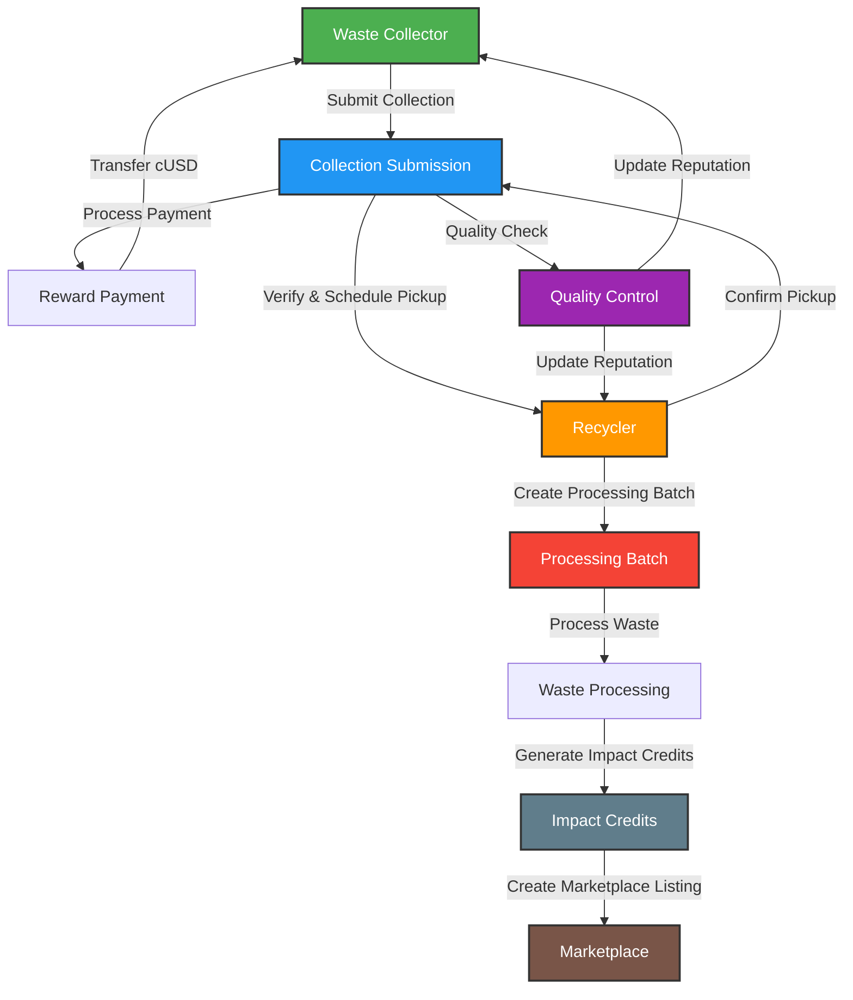

# AfriCycle: A Multi-Stream ReFi Waste Management Ecosystem

> 🚀 **Now Live on Celo Mainnet - Currently in Beta Testing Phase** 🚀
> 
> 
## 🌍 Overview
AfriCycle is a blockchain-powered circular economy platform that addresses Africa's waste management crisis across three key waste streams: **plastic**, **electronic waste (e-waste)**, and **metal/general waste**. The platform incentivizes waste collection through **tokenized rewards**, enables **transparent recycling processes**, and promotes **corporate sustainability** through verified **recycling credits**.

### 🎯 Current Status
- **Live on Celo Mainnet** 🟢
- **Beta Testing Phase** 🔄
- **Open for Early Adopters** 👥
- **Community Growth**: Active Telegram community 
- **Platform Updates**: Regular feature releases and improvements
- **Mobile Optimization**: Enhanced mobile experience for collectors and recyclers

### 🏆 Recent Improvements (Based on Security Analysis)
- **Enhanced Test Coverage**: Comprehensive 3-tier testing strategy (Unit, Integration, E2E)
- **Improved Security**: Robust secrets management and security best practices
- **Community Building**: Comprehensive strategy for growing developer community
- **Better Documentation**: Enhanced contributing guidelines and templates
- **CI/CD Pipeline**: Automated testing, security scanning, and deployment

## 🔄 System Workflow


### Role-Based Workflow Description

1. **Waste Collector**
   - Complete registration and verification
   - Submit waste collections with details (type, weight, location, image)
   - Schedule pickups with recyclers
   - Receive cUSD payments based on waste type and quality
   - Access G$ Universal Basic Income with real-time claim tracking
   - Build reputation through consistent quality submissions
   - Track earnings (cUSD) and G$ UBI benefits through integrated dashboard

2. **Recycler**
   - Complete facility verification
   - Accept and verify waste collections
   - Create processing batches for waste recycling
   - Generate impact credits through verified processing
   - Manage inventory and track processing efficiency
   - Earn through processing fees
   - **Marketplace integration** (coming Q2 2026): Create listings and trade processed materials

### Key Features
- **Automated Payments**: Direct cUSD transfers for collections
- **G$ UBI Integration**: Real-time tracking of GoodDollar Universal Basic Income claims
- **Quality-Based Rewards**: Higher rewards for better quality waste
- **Reputation System**: Score-based trust mechanism
- **Impact Credits**: Verified environmental impact tokens
- **Batch Processing**: Efficient handling of multiple collections
- **Carbon Offset Tracking**: Environmental impact measurement
- **Quality Assurance**: Automated verification and quality checks
- **Live Countdown Timers**: Real-time tracking of next G$ UBI claim availability
- **Cross-Platform G$ Tracking**: Captures G$ claims made anywhere on the Celo network
- **Marketplace Integration** (Q2 2026): Trading platform for processed materials

## 🚀 Features
### ♻️ Multi-Stream Waste Collection
- **Plastic Waste**: photo based verification and weight-based tracking.
- **E-Waste**: Detailed documentation of valuable components such as CPUs, batteries, and PCBs.
- **Metal & General Waste**: Categorization, weight-based verification, and quality assessment.
- **Real-time Tracking**: Live monitoring of waste collection and processing
- **Quality Assurance**: Automated verification of waste categories and conditions

### 🔗 Blockchain-Based Verification
- **Decentralized authentication** of waste collection.
- **Immutable record-keeping** for recycling activities.
- **Transparent supply chain management**.
- **Smart Contract Automation**: Automated payments and verification processes
- **Audit Trail**: Complete history of all waste transactions

### 🎁 Tokenized Incentive System
- **Direct cryptocurrency payments** to collectors and recyclers
- **Tokenized environmental impact credits**.
- **Dynamic Pricing**: Market-based compensation for different waste types
- **Loyalty Rewards**: Additional incentives for consistent collectors

### 💰 G$ UBI Integration
- **Real-time G$ UBI tracking** with blockchain data verification
- **Live countdown timers** for next claim availability (days:hours:minutes:seconds)
- **Comprehensive claim history** showing all G$ transactions with proper timestamps
- **Cross-platform compatibility** - tracks G$ claims made anywhere on Celo network
- **Dual currency support** - separates recycling earnings (cUSD) from UBI benefits (G$)
- **Dashboard integration** - G$ statistics displayed alongside recycling metrics
- **Persistent tracking** - maintains G$ claim data across app sessions


### 🏪 Marketplace Ecosystem (Coming Q2 2026)
- **Trading platform for recycled materials** - *In Development*
- **Carbon/waste offset marketplace** for corporations - *Planned*
- **Impact investment opportunities** - *Future Release*
- **Corporate Sustainability Credits**: Verified environmental impact tokens - *Development Phase*  
- **Material Exchange**: Direct trading of processed recyclables - *Q2 2026 Launch*

## 🏗 Technical Architecture
### 🛠 Blockchain Infrastructure
AfriCycle is built on the **Celo blockchain** for:
- **Mobile-first design** (lightweight clients for low-end devices)
- **Low transaction costs** (gas fees <$0.001 per transaction)
- **Sustainable consensus** (Proof-of-Stake validation, carbon-negative infrastructure)

### 🌐 Frontend Application
- **Next.js 14** with App Router for modern React development
- **TypeScript** for type safety and better developer experience
- **Tailwind CSS** for utility-first styling
- **Radix UI** for accessible component primitives
- **Recharts** for data visualization
- **Progressive Web App (PWA)** capabilities
- **Responsive design** for mobile and desktop access
- **G$ UBI Integration** with real-time countdown timers and blockchain tracking
- **Dual currency support** for cUSD recycling earnings and G$ UBI benefits

### 🖥 Backend Infrastructure
- **Hardhat** for smart contract development and testing
- **TypeScript** for contract development
- **OpenZeppelin** for secure contract implementations
- **IPFS** for decentralized media storage
- **Ceramic Network** for decentralized identity

### 📦 Blockchain Integration
- **ContractKit** for Celo-specific features
- **wagami/viem** for smart contract interactions
- **Metamask and Valora wallet integrations**
- **Hardhat Network** for local development
- **GoodDollar Citizen SDK** for G$ UBI claim verification and tracking
- **Real-time blockchain queries** for cross-platform G$ transaction history

## 🛠 Tech Stack
### Core Technologies
- **Blockchain**: Celo
- **Smart Contracts**: Solidity, Hardhat, TypeScript
- **Frontend**: Next.js 14, TypeScript, Tailwind CSS, Radix UI
- **G$ UBI Integration**: GoodDollar Citizen SDK for Universal Basic Income tracking

### Development & Testing
- **Development**: Yarn Workspaces, ESLint, Prettier
- **Testing Framework**: 3-tier comprehensive testing approach
  - **Unit Tests**: Jest + React Testing Library
  - **Integration Tests**: Vitest + Real blockchain interactions
  - **E2E Tests**: Playwright + Multi-browser testing
- **Smart Contract Testing**: Expanded test coverage (1865+ lines)
- **Security Testing**: Comprehensive edge case and vulnerability testing

### Infrastructure & DevOps
- **Containerization**: Docker + Docker Compose
- **Database**: PostgreSQL
- **Caching**: Redis
- **Web Server**: Nginx with security headers
- **Monitoring**: Prometheus + Grafana
- **Storage**: IPFS, Ceramic Network

### Security & Compliance
- **Security Framework**: Comprehensive security documentation ([📖 View Details](docs/SECURITY.md))
- **Bug Bounty Program**:([📖 View Program](docs/BUG_BOUNTY.md))
- **Audit Schedule**: Professional security audit (August 2025) ([📖 View Schedule](docs/SECURITY_AUDIT_SCHEDULE.md))
- **Incident Response**: Complete incident response procedures ([📖 View Procedures](docs/SECURITY.md#-incident-response))

## 🚀 Getting Started

### 🐳 Quick Start with Docker (Recommended)
The fastest way to get started is with our comprehensive Docker setup - [📖 Full Docker Guide](docker/README.md):

```bash
# Clone the repository
git clone https://github.com/your-org/africycle.git
cd africycle

# One-command setup (installs everything and starts all services)
./scripts/docker-setup.sh

# Access the application
# Frontend: http://localhost:3000
# Hardhat Node: http://localhost:8545
# Database: postgresql://localhost:5432
# Grafana: http://localhost:3001
```

### 📥 Manual Setup Prerequisites
If you prefer manual setup, ensure you have ([📖 Detailed Environment Guide](docs/ENVIRONMENT.md)):
- [Node.js](https://nodejs.org/) (v18 or higher)
- [Yarn](https://yarnpkg.com/) (v1.22 or higher)
- [Docker](https://docker.com/) and [Docker Compose](https://docs.docker.com/compose/)
- [Metamask](https://metamask.io/) or [Valora](https://valoraapp.com/)
- [Git](https://git-scm.com/)

### 📌 Manual Installation
```bash
# Clone the repository
git clone https://github.com/your-org/africycle.git
cd africycle

# Install dependencies
yarn install

# Set up environment variables
cp packages/react-app/.env.example packages/react-app/.env
cp packages/hardhat/.env.example packages/hardhat/.env

# Edit environment files with your configuration
nano packages/react-app/.env
nano packages/hardhat/.env
```

### 🛠 Development Workflows

#### Option 1: Docker Development (Recommended)
```bash
# Start all services
docker-compose up

# Start in development mode with hot reload
docker-compose -f docker-compose.yml up --build

# View logs
docker-compose logs -f frontend
docker-compose logs -f hardhat
```

#### Option 2: Manual Development
```bash
# Start the local blockchain
yarn hardhat:run:node

# In a new terminal, deploy contracts
yarn hardhat:compile
yarn hardhat:build

# Start the frontend development server
yarn react-app:dev
```

### 🧪 Comprehensive Testing Framework
Our 3-tier testing approach ensures maximum code quality and security - [📖 Complete Testing Guide](packages/react-app/tests/README.md):

#### Run All Tests
```bash
# Docker environment
docker-compose exec frontend npm test

# Manual environment
yarn test
```

#### Individual Test Types
```bash
# Unit Tests (Jest + React Testing Library)
yarn test:unit

# Integration Tests (Vitest + Real blockchain)
yarn test:integration

# E2E Tests (Playwright + Multi-browser)
yarn test:e2e

# Smart Contract Tests (Expanded coverage - 1865+ lines)
yarn hardhat:test
```

#### Test Coverage Requirements
- **Frontend**: Minimum 80% coverage (Unit, Integration, E2E)
- **Smart Contracts**: Minimum 90% coverage (Unit, Integration)
- **CI/CD**: Automated testing on every pull request
- **Security**: Automated security scanning and vulnerability checks

### 🔒 Security & Best Practices
- **Secrets Management**: Comprehensive guide for secure credential handling
- **Code Quality**: Automated linting, formatting, and type checking
- **Security Scanning**: Automated vulnerability detection
- **Access Control**: Role-based permissions and authentication
- **Audit Trail**: Complete logging and monitoring

### 🌟 Community & Contribution
We welcome contributions from developers, environmentalists, and blockchain enthusiasts! - [📖 Contributing Guide](docs/CONTRIBUTING.md)

#### Quick Start for Contributors
```bash
# Fork and clone the repository
git clone https://github.com/YOUR_USERNAME/Africycle.git
cd Africycle

# Set up development environment
./scripts/docker-setup.sh

# Create a feature branch
git checkout -b feature/your-feature-name

# Make your changes and run tests
yarn test

# Submit a pull request
```

#### Community Resources
- **Telegram**: Join our community chat
- **X/Twitter**: Follow us for updates and discussions
- **GitHub Discussions**: Ask questions and share ideas
- **Documentation**: Comprehensive guides and tutorials
- **Bug Reports**: Use our detailed issue templates
- **Feature Requests**: Submit enhancement proposals

#### Community Programs
- **Mentorship Program**: Pair with experienced developers
- **Contributor Recognition**: Hall of fame and rewards

### �� Development Tools

#### Monitoring & Analytics
- **Grafana Dashboard**: http://localhost:3001 (admin/admin)
- **Prometheus Metrics**: http://localhost:9090


#### Development URLs
- **Frontend**: http://localhost:3000
- **Hardhat Node**: http://localhost:8545
- **Database**: postgresql://localhost:5432
- **Redis**: redis://localhost:6379

 **Join Beta Testing**
   - Join [Here](https://forms.gle/rRX8tS6yeSftxtpv5)

### 📄 Project Structure
```
africycle/
├── packages/
│   ├── react-app/              # Next.js frontend application
│   │   ├── app/               # App router pages and layouts
│   │   ├── components/        # Reusable UI components
│   │   ├── hooks/            # Custom React hooks
│   │   ├── lib/              # Utility functions and configurations
│   │   ├── providers/        # React context providers
│   │   ├── styles/           # Global styles and Tailwind config
│   │   ├── tests/            # Comprehensive testing suite
│   │   │   ├── unit/         # Jest + React Testing Library tests
│   │   │   ├── integration/  # Vitest + blockchain integration tests
│   │   │   └── e2e/          # Playwright end-to-end tests
│   │   ├── .env.example      # Environment variables template
│   │   ├── Dockerfile        # Docker container configuration
│   │   ├── jest.config.js    # Jest unit testing configuration
│   │   ├── vitest.config.ts  # Vitest integration testing configuration
│   │   └── playwright.config.ts # Playwright E2E testing configuration
│   │
│   └── hardhat/              # Smart contract development
│       ├── contracts/        # Solidity smart contracts
│       ├── scripts/          # Deployment and utility scripts
│       ├── test/             # Comprehensive contract tests (1865+ lines)
│       ├── .env.example      # Blockchain environment variables template
│       └── Dockerfile        # Docker container configuration
│
├── docs/                     # Comprehensive documentation
│   ├── CONTRIBUTING.md       # Contribution guidelines
│   ├── ENVIRONMENT.md        # Environment setup guide
│   ├── FRONTEND.md          # Frontend development guide
│   ├── SMART_CONTRACTS.md   # Smart contract documentation
│   ├── SECURITY.md          # Security framework and procedures
│   └── SECURITY_AUDIT_SCHEDULE.md # Security audit timeline
│
├── docker/                   # Docker infrastructure
│   ├── nginx/               # Nginx web server configurations
│   ├── README.md            # Docker setup documentation
│   └── monitoring/          # Prometheus + Grafana setup
│
├── scripts/                  # Automation scripts
│   ├── docker-setup.sh      # One-command development setup
│   └── init-db.sql          # Database initialization
│
├── docker-compose.yml        # Development environment
├── docker-compose.prod.yml   # Production environment
├── docker.env.example       # Docker environment template
├── .dockerignore            # Docker build exclusions
└── package.json             # Root package.json for workspace management
```

## 🧑‍💻 Contributing
We welcome contributions from developers, environmentalists, and community members! 

### 📋 Quick Start for Contributors
- **📖 Read First**: [Contributing Guidelines](docs/CONTRIBUTING.md) - Complete setup and contribution guide
- **🔧 Environment Setup**: [Environment Guide](docs/ENVIRONMENT.md) - Detailed setup instructions
- **🏗️ Smart Contracts**: [Smart Contract Guide](docs/SMART_CONTRACTS.md) - Contract development documentation
- **🌐 Frontend**: [Frontend Guide](docs/FRONTEND.md) - Frontend development guide

### 🛠️ Development Areas

#### 1. **Code Contributions**
   - Fork the repository
   - Create a feature branch: `git checkout -b feature/your-feature`
   - Make your changes
   - Run tests: `yarn hardhat:test`
   - Submit a pull request

#### 2. **Smart Contract Development**
   - Review our [📖 Smart Contract Documentation](docs/SMART_CONTRACTS.md)
   - Follow our [📋 Contributing Guidelines](docs/CONTRIBUTING.md)
   - Test thoroughly using our comprehensive test suite (1865+ lines)
   - Submit improvements or bug fixes

#### 3. **Frontend Development**
   - Check our [🌐 Frontend Guidelines](docs/FRONTEND.md)
   - Follow our [📋 Contributing Guidelines](docs/CONTRIBUTING.md)
   - Implement new features or improvements
   - Ensure mobile responsiveness

#### 4. **Documentation**
   - Improve existing documentation in the `docs` directory
   - Add code comments
   - Create tutorials or guides
   - Translate documentation

#### 5. **Community Support**
   - Help users in our [Telegram community](https://t.me/africycle)
   - Report bugs or issues on [GitHub Issues](https://github.com/Africycle/Africycle/issues)
   - Suggest improvements
   - Share your experience

### 🔧 Development Guidelines
- Follow our [📋 Contributing Guidelines](docs/CONTRIBUTING.md)
- Write clear commit messages
- Include tests for new features
- Update documentation as needed
- Join our development discussions

### 🆘 Getting Help
- Join our [Telegram Development Group](https://t.me/africycle)
- Check our [📖 Environment Setup Guide](docs/ENVIRONMENT.md)
- Review our [🐳 Docker Setup Guide](docker/README.md)
- Open an issue for bugs or feature requests
- Contact the team at info@africycle.xyz

## 📝 License
This project is licensed under the **MIT License**.

## 📞 Contact & Support
- **Twitter**: [@AfriCycle](https://twitter.com/africycle)
- **Email**: info@africycle.xyz
- **Telegram**: [Join our community](https://t.me/africycle)
- **Documentation**: [White paper ](https://africycle.hashnode.space/default-guide/africycle)
- **Support Hours**: 24/7 automated support with human assistance during business hours

## 🔒 Security & Audit Framework

### 🛡️ Comprehensive Security Infrastructure
AfriCycle implements enterprise-grade security measures given the financial and environmental implications of our platform:

#### Smart Contract Security
- **Access Control**: Role-based permissions (Admin, Collector, Recycler)
- **Reentrancy Protection**: NonReentrant modifiers on critical functions
- **Pausable Contract**: Emergency pause mechanism for incident response
- **Input Validation**: Comprehensive parameter validation
- **Overflow Protection**: Solidity 0.8+ built-in protections

#### Security Testing
- **Comprehensive Test Coverage**: 1865+ lines of security-focused tests
- **Vulnerability Testing**: Edge cases, access control, and attack vectors
- **Automated Security Scanning**: Integrated security scanning tools
- **Manual Security Reviews**: Regular code security reviews

### 🐛 Bug Bounty Program
We operate a comprehensive bug bounty program with competitive rewards:

#### Reward Structure
- **Critical Vulnerabilities**: $5,000 - $10,000
- **High Vulnerabilities**: $2,000 - $5,000
- **Medium Vulnerabilities**: $500 - $2,000
- **Low Vulnerabilities**: $100 - $500

#### Reporting Process
- **Contact**: info@africycle.xyz
- **Response Time**: 24 hours initial response
- **Coordinated Disclosure**: 90-day disclosure timeline
- **Recognition**: Public recognition for responsible disclosure

### 🔍 Professional Security Audit
- **Audit Schedule**: Comprehensive 8-week security audit (August 2025) - [📋 View Detailed Schedule](docs/SECURITY_AUDIT_SCHEDULE.md)
- **Audit Partners**: Professional security auditing firms (to be selected)
- **Audit Scope**: Smart contracts, frontend, and infrastructure

#### Audit Timeline
- **Phase 1**: Pre-audit preparation (Weeks 1-2)
- **Phase 2**: Smart contract security audit (Weeks 3-4)
- **Phase 3**: Frontend & infrastructure audit (Weeks 5-6)
- **Phase 4**: Integration testing & final review (Weeks 7-8)

### 🚨 Incident Response
- **24/7 Monitoring**: Continuous security monitoring
- **Incident Classification**: 4-level severity system
- **Response Team**: Dedicated incident response team
- **Communication**: Transparent incident communication

### 📋 Security Documentation
- **Security Framework**: Complete security procedures ([SECURITY.md](docs/SECURITY.md))
- **Audit Schedule**: Detailed audit timeline ([SECURITY_AUDIT_SCHEDULE.md](docs/SECURITY_AUDIT_SCHEDULE.md))
- **Incident Response**: Comprehensive incident response procedures
- **Security Training**: Regular security training for development team

### 🔐 Security Best Practices
- **Regular Updates**: Monthly security updates and patches
- **Dependency Scanning**: Automated dependency vulnerability scanning
- **Code Reviews**: Mandatory security code reviews
- **Access Controls**: Strict access controls and permissions
- **Monitoring**: Real-time security monitoring and alerting

## 📈 Roadmap

### 🎯 Current Status (Q3 2025)
- **Live on Celo Mainnet**: Platform deployed and operational
- **Beta Testing Active**: Community testing with real users
- **Development Complete**: Full-stack development completed (Q2 2025)
- **Infrastructure Complete**: Docker, testing, and security frameworks implemented
- **Security Audit Preparation**: Comprehensive security documentation and procedures ready

### 🚀 Development Timeline

#### Q2 2025: **Core Development Phase** ✅
- **Platform Development**: Complete frontend and smart contract development
- **Testing Framework**: Implemented 3-tier testing approach (1865+ test lines)
- **Infrastructure Setup**: Docker containerization and CI/CD pipeline
- **Security Framework**: Comprehensive security documentation and procedures

#### Q3 2025: **Current - Pre-Audit Phase** 🔄
- **Security Audit Preparation**: Final preparation for comprehensive security audit
- **Community Growth**: Expanded beta testing program
- **Documentation**: Complete technical and security documentation
- **Bug Bounty Program**: Active security researcher engagement

#### Q4 2025: **Security Audit & Validation**
- **Professional Security Audit**: 8-week comprehensive security audit (August 2025)
- **Vulnerability Remediation**: Address all audit findings
- **Security Certification**: Obtain security clearance certificates
- **Platform Hardening**: Implement additional security measures

#### Q1 2026: **Pilot Launch & Partnerships**
- **Post-Audit Launch**: Full platform launch with security certification
- **Strategic Partnerships**: Corporate and institutional partnerships
- **Pilot Program Rollout**: Scaled pilot programs across Africa
- **Advanced Features**: Enhanced platform capabilities

#### Q2 2026: **Marketplace Ecosystem Launch**
- **Trading Platform**: Full trading platform for recycled materials
- **Carbon Offset Marketplace**: Corporate sustainability credits marketplace
- **Mobile Applications**: Native iOS and Android applications
- **Enterprise Integration**: B2B platform integrations

### 🔐 Security Milestones
- **July 2025**: Security documentation complete ✅
- **August 2025**: Comprehensive security audit begins
- **October 2025**: Audit completion and certification
- **November 2025**: Security-certified platform launch

## 📊 Beta Testing Metrics
- **Active Users**: Growing community of waste collectors
- **Collection Points**: Multiple verified locations across Africa
- **Waste Processed**: Real-time tracking available on dashboard
- **Environmental Impact**: Transparent impact metrics
- **Transaction Volume**: Live on-chain data
- **G$ UBI Integration**: Real-time Universal Basic Income tracking and claim management
- **Community Engagement**: Active participation in Telegram and social media
- **User Satisfaction**: Positive feedback from early adopters

## 🤝 Join the Beta
We're actively seeking:
- Waste Collectors
- Recyclers
- Corporate Partners
- Environmental Impact Investors

To participate in our beta testing program:
1. Fill out our [Beta Testing Application Form](https://forms.gle/rRX8tS6yeSftxtpv5)
2. Join our [Telegram Community](https://t.me/africycle) for updates and support
3. Wait for our team to review your application
4. Once approved, you'll receive instructions to access the platform
5. Complete the onboarding process and start contributing to a sustainable future

For any questions about the beta program, please contact us at info@africycle.xyz

## 📚 Documentation

### 🗂️ Complete Documentation Index
Our comprehensive documentation covers all aspects of the platform:

#### 🚀 Getting Started
- **[🔧 Environment Setup](docs/ENVIRONMENT.md)** - Complete environment configuration guide
- **[🐳 Docker Setup](docker/README.md)** - One-command Docker development setup
- **[📋 Contributing Guidelines](docs/CONTRIBUTING.md)** - How to contribute to the project

#### 🛠️ Development Guides
- **[🌐 Frontend Development](docs/FRONTEND.md)** - Next.js frontend development guide
- **[🏗️ Smart Contract Development](docs/SMART_CONTRACTS.md)** - Solidity contract development
- **[🧪 Testing Framework](packages/react-app/tests/README.md)** - 3-tier testing approach guide

#### 🔒 Security Documentation
- **[🛡️ Security Framework](docs/SECURITY.md)** - Comprehensive security procedures and incident response
- **[🐛 Bug Bounty Program](docs/BUG_BOUNTY.md)** - $100-$10,000 reward program for security researchers
- **[📋 Security Audit Schedule](docs/SECURITY_AUDIT_SCHEDULE.md)** - Detailed 8-week audit timeline and procedures

#### 📊 Project Information
- **[📖 README](README.md)** - This file - Project overview and quick start
- **[📄 License](LICENSE)** - MIT License details

### 🔗 Quick Links
- **Environment Setup**: [docs/ENVIRONMENT.md](docs/ENVIRONMENT.md)
- **Docker Guide**: [docker/README.md](docker/README.md)
- **Contributing**: [docs/CONTRIBUTING.md](docs/CONTRIBUTING.md)
- **Security**: [docs/SECURITY.md](docs/SECURITY.md)
- **Bug Bounty**: [docs/BUG_BOUNTY.md](docs/BUG_BOUNTY.md)
- **Testing**: [packages/react-app/tests/README.md](packages/react-app/tests/README.md)
