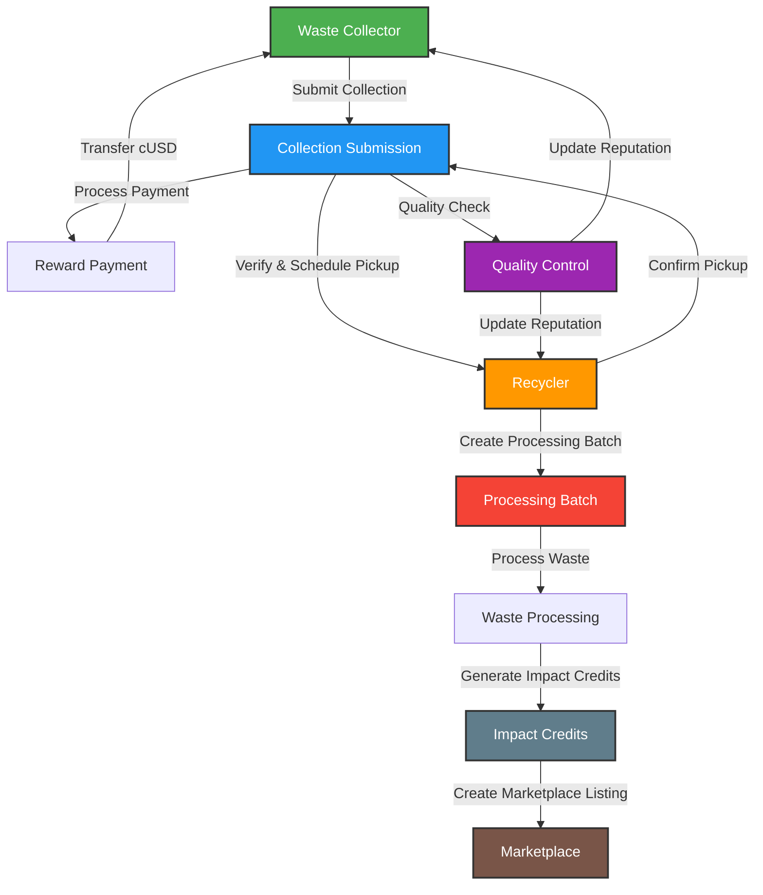

# AfriCycle: A Multi-Stream ReFi Waste Management Ecosystem

> 🚀 **Now Live on Celo Mainnet - Currently in Beta Testing Phase** 🚀
> 
> 📜 **Verified Smart Contract**: [View on CeloScan](https://celoscan.io/address/0xca37C3123CD9eE8c49409A8c225b5c440F5eBc46#code)

## 🌍 Overview
AfriCycle is a blockchain-powered circular economy platform that addresses Africa's waste management crisis across three key waste streams: **plastic**, **electronic waste (e-waste)**, and **metal/general waste**. The platform incentivizes waste collection through **tokenized rewards**, enables **transparent recycling processes**, and promotes **corporate sustainability** through verified **recycling credits**.

### 🎯 Current Status
- **Live on Celo Mainnet** 🟢
- **Beta Testing Phase** 🔄
- **Open for Early Adopters** 👥
- **Verified Smart Contract**: [0xca37C3123CD9eE8c49409A8c225b5c440F5eBc46](https://celoscan.io/address/0xca37C3123CD9eE8c49409A8c225b5c440F5eBc46#code)
- **Community Growth**: Active Telegram community with daily engagement
- **Platform Updates**: Regular feature releases and improvements
- **Mobile Optimization**: Enhanced mobile experience for collectors

## 🔄 System Workflow


### Role-Based Workflow Description

1. **Waste Collector**
   - Complete registration and verification
   - Submit waste collections with details (type, weight, location, image)
   - Schedule pickups with recyclers
   - Receive cUSD payments based on waste type and quality
   - Build reputation through consistent quality submissions
   - Track earnings and impact through dashboard

2. **Recycler**
   - Complete facility verification
   - Accept and verify waste collections
   - Create processing batches for waste recycling
   - Generate impact credits through verified processing
   - Create marketplace listings for processed materials
   - Manage inventory and track processing efficiency
   - Earn through processing fees and marketplace sales

### Key Features
- **Automated Payments**: Direct cUSD transfers for collections
- **Quality-Based Rewards**: Higher rewards for better quality waste
- **Reputation System**: Score-based trust mechanism
- **Impact Credits**: Verified environmental impact tokens
- **Marketplace**: Trading platform for processed materials
- **Batch Processing**: Efficient handling of multiple collections
- **Carbon Offset Tracking**: Environmental impact measurement
- **Quality Assurance**: Automated verification and quality checks

## 🚀 Features
### ♻️ Multi-Stream Waste Collection
- **Plastic Waste**: QR-code-based verification and weight-based tracking.
- **E-Waste**: Detailed documentation of valuable components such as CPUs, batteries, and PCBs.
- **Metal & General Waste**: Categorization, weight-based verification, and quality assessment.
- **Real-time Tracking**: Live monitoring of waste collection and processing
- **Quality Assurance**: Automated verification of waste categories and conditions

### 🔗 Blockchain-Based Verification
- **Decentralized authentication** of waste collection.
- **Immutable record-keeping** for recycling activities.
- **Transparent supply chain management**.
- **Smart Contract Automation**: Automated payments and verification processes
- **Audit Trail**: Complete history of all waste transactions

### 🎁 Tokenized Incentive System
- **Direct cryptocurrency payments** to collectors.
- **Tokenized environmental impact credits**.
- **Governance tokens** for platform participation.
- **Dynamic Pricing**: Market-based compensation for different waste types
- **Loyalty Rewards**: Additional incentives for consistent collectors

### 🏪 Marketplace Ecosystem
- **Trading platform for recycled materials**.
- **Carbon/waste offset marketplace** for corporations.
- **Impact investment opportunities**.
- **Corporate Sustainability Credits**: Verified environmental impact tokens
- **Material Exchange**: Direct trading of processed recyclables

## 🏗 Technical Architecture
### 🛠 Blockchain Infrastructure
AfriCycle is built on the **Celo blockchain** for:
- **Mobile-first design** (lightweight clients for low-end devices)
- **Low transaction costs** (gas fees <$0.001 per transaction)
- **Sustainable consensus** (Proof-of-Stake validation, carbon-negative infrastructure)

### 🌐 Frontend Application
- **Next.js 14** with App Router for modern React development
- **TypeScript** for type safety and better developer experience
- **Tailwind CSS** for utility-first styling
- **Radix UI** for accessible component primitives
- **Recharts** for data visualization
- **Progressive Web App (PWA)** capabilities
- **Responsive design** for mobile and desktop access

### 🖥 Backend Infrastructure
- **Hardhat** for smart contract development and testing
- **TypeScript** for contract development
- **OpenZeppelin** for secure contract implementations
- **IPFS** for decentralized media storage
- **Ceramic Network** for decentralized identity

### 📦 Blockchain Integration
- **ContractKit** for Celo-specific features
- **Web3.js/Ethers.js** for smart contract interactions
- **Metamask and Valora wallet integrations**
- **Hardhat Network** for local development

## 🛠 Tech Stack
- **Blockchain**: Celo
- **Smart Contracts**: Solidity, Hardhat, TypeScript
- **Frontend**: Next.js 14, TypeScript, Tailwind CSS, Radix UI
- **Development**: Yarn Workspaces, ESLint, Prettier
- **Testing**: Mocha, Chai
- **Storage**: IPFS, Ceramic Network

## 🚀 Getting Started
### 📥 Prerequisites
Ensure you have the following installed:
- [Node.js](https://nodejs.org/) (v18 or higher)
- [Yarn](https://yarnpkg.com/) (v1.22 or higher)
- [Metamask](https://metamask.io/) or [Valora](https://valoraapp.com/)
- [Git](https://git-scm.com/)

 **Join Beta Testing**
   - Join [Here](https://forms.gle/rRX8tS6yeSftxtpv5)

### 📌 Installation
```bash
# Clone the repository
git clone https://github.com/your-org/africycle.git

# Navigate into the project directory
cd africycle

# Install dependencies
yarn install

# Set up environment variables
cp packages/react-app/.env.template packages/react-app/.env
```

### 🛠 Development
```bash
# Start the local blockchain
yarn hardhat:run:node

# In a new terminal, deploy contracts
yarn hardhat:compile
yarn hardhat:build

# Start the frontend development server
yarn react-app:dev
```

### 🧪 Testing
```bash
# Run smart contract tests
yarn hardhat:test

# Run frontend tests
yarn react-app:test
```

### 🏗 Project Structure
```
africycle/
├── packages/
│   ├── react-app/          # Next.js frontend application
│   │   ├── app/           # App router pages and layouts
│   │   ├── components/    # Reusable UI components
│   │   ├── hooks/        # Custom React hooks
│   │   ├── lib/          # Utility functions and configurations
│   │   ├── providers/    # React context providers
│   │   └── styles/       # Global styles and Tailwind config
│   │
│   └── hardhat/          # Smart contract development
│       ├── contracts/    # Solidity smart contracts
│       ├── scripts/      # Deployment and utility scripts
│       └── test/         # Contract tests
│
└── package.json          # Root package.json for workspace management
```

## 🧑‍💻 Contributing
We welcome contributions from developers, environmentalists, and community members! Here's how you can contribute:

1. **Code Contributions**
   - Fork the repository
   - Create a feature branch: `git checkout -b feature/your-feature`
   - Make your changes
   - Run tests: `yarn hardhat:test`
   - Submit a pull request

2. **Smart Contract Development**
   - Review our [contract documentation](docs/SMART_CONTRACTS.md)
   - Follow our [contributing guidelines](docs/CONTRIBUTING.md)
   - Test thoroughly using our test suite in `packages/hardhat/test`
   - Submit improvements or bug fixes

3. **Frontend Development**
   - Check our [Next.js app](packages/react-app)
   - Follow our [frontend guidelines](docs/FRONTEND.md)
   - Implement new features or improvements
   - Ensure mobile responsiveness

4. **Documentation**
   - Improve existing documentation in the `docs` directory
   - Add code comments
   - Create tutorials or guides
   - Translate documentation

5. **Community Support**
   - Help users in our [Telegram community](https://t.me/+aCZcunVKdkw2NDc0)
   - Report bugs or issues on [GitHub Issues](https://github.com/Africycle/Africycle/issues)
   - Suggest improvements
   - Share your experience

### Development Guidelines
- Follow our [contributing guidelines](docs/CONTRIBUTING.md)
- Write clear commit messages
- Include tests for new features
- Update documentation as needed
- Join our development discussions

### Getting Help
- Join our [Telegram Development Group](https://t.me/+aCZcunVKdkw2NDc0)
- Check our [environment setup guide](docs/ENVIRONMENT.md)
- Open an issue for bugs or feature requests
- Contact the team at aficycle0@gmail.com or info@africycle.xyz

## 📝 License
This project is licensed under the **MIT License**.

## 📞 Contact & Support
- **Twitter**: [@AfriCycle](https://twitter.com/africycle)
- **Email**: aficycle0@gmail.com or info@africycle.xyz
- **Telegram**: [Join our community](https://t.me/+aCZcunVKdkw2NDc0)
- **Documentation**: [White paper ](https://africycle.hashnode.space/default-guide/africycle)
- **Support Hours**: 24/7 automated support with human assistance during business hours

## 🔒 Security
- Regular security updates and patches
- Bug bounty program for security researchers

## 📈 Roadmap
- Q2 2024: Current Phase - Beta testing and community building
- Q3 2024: Expansion to additional African regions
- Q4 2024: Launch of advanced features and partnerships
- Q1 2025: Global expansion and ecosystem growth
- Q2 2025: Integration with international waste management networks

## 📊 Beta Testing Metrics
- **Active Users**: Growing community of waste collectors
- **Collection Points**: Multiple verified locations across Africa
- **Waste Processed**: Real-time tracking available on dashboard
- **Environmental Impact**: Transparent impact metrics
- **Transaction Volume**: Live on-chain data
- **Community Engagement**: Active participation in Telegram and social media
- **User Satisfaction**: Positive feedback from early adopters

## 🤝 Join the Beta
We're actively seeking:
- Waste Collectors
- Recyclers
- Corporate Partners
- Environmental Impact Investors

To participate in our beta testing program:
1. Fill out our [Beta Testing Application Form](https://forms.gle/rRX8tS6yeSftxtpv5)
2. Join our [Telegram Community](https://t.me/+aCZcunVKdkw2NDc0) for updates and support
3. Wait for our team to review your application
4. Once approved, you'll receive instructions to access the platform
5. Complete the onboarding process and start contributing to a sustainable future

For any questions about the beta program, please contact us at aficycle0@gmail.com
