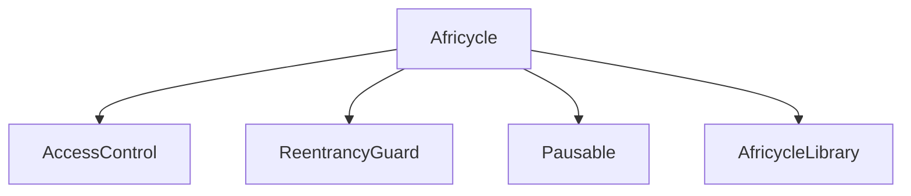

# Smart Contracts Documentation

This document provides detailed information about the smart contracts used in the Africycle project.

## Table of Contents

- [Overview](#overview)
- [Contract Architecture](#contract-architecture)
- [Contract Details](#contract-details)
- [Security](#security)
- [Testing](#testing)
- [Deployment](#deployment)
- [Interacting with Contracts](#interacting-with-contracts)

## Overview

Africycle's smart contracts are built on the Celo blockchain and implement a comprehensive waste management and recycling platform. The system is built around a single main contract (`Africycle.sol`) with a supporting library (`AfricycleLibrary.sol`). The contracts handle:

- Waste collection and recycling tracking
- Marketplace for waste trading
- Impact credits for environmental contributions
- Reputation system for collectors and recyclers
- Carbon offset tracking
- Quality assessment system

## Contract Architecture

### Core Contracts

1. **Africycle (Main Contract)**
   - Handles all core platform functionality
   - Implements role-based access control
   - Manages waste collection and recycling
   - Controls marketplace operations
   - Handles impact credits and carbon offsets
   - Manages user profiles and reputation

2. **AfricycleLibrary**
   - Contains shared functions and data structures
   - Defines constants and enums
   - Provides utility functions for calculations
   - Implements validation logic

### Inheritance Structure



## Contract Details

### Africycle Contract

The main contract implements the following key features:

#### Role-Based Access Control
- ADMIN_ROLE: Platform administrators
- COLLECTOR_ROLE: Waste collectors
- RECYCLER_ROLE: Recycling facilities

#### Core Data Structures
```solidity
struct UserProfile {
    string name;
    string location;
    string contactInfo;
    Status status;
    uint256 registrationDate;
    uint256 verificationDate;
    bool isVerified;
    bytes32 role;
    CollectorProfile collectorProfile;
    RecyclerProfile recyclerProfile;
}

struct WasteCollection {
    uint256 id;
    address collector;
    WasteStream wasteType;
    uint256 weight;
    string location;
    string imageHash;
    Status status;
    uint256 timestamp;
    QualityGrade quality;
    uint256 rewardAmount;
    bool isProcessed;
    uint256 pickupTime;
    address selectedRecycler;
}

struct MarketplaceListing {
    uint256 id;
    address seller;
    WasteStream wasteType;
    uint256 amount;
    uint256 pricePerUnit;
    QualityGrade quality;
    bool isActive;
    uint256 timestamp;
    string description;
    Status status;
}
```

#### Key Functions

1. **User Management**
   - `registerCollector`: Register new waste collectors
   - `registerRecycler`: Register new recycling facilities
   - `updateUserProfile`: Update user information
   - `grantRole`: Assign roles to users

2. **Waste Collection**
   - `createCollection`: Create new waste collection
   - `batchCreateCollection`: Create multiple collections
   - `confirmPickup`: Confirm waste pickup
   - `verifyCollection`: Verify collection quality

3. **Marketplace**
   - `createListing`: Create marketplace listing
   - `purchaseListing`: Purchase waste from marketplace
   - `cancelListing`: Cancel active listing
   - `updateListing`: Update listing details

4. **Processing**
   - `createProcessingBatch`: Create new processing batch
   - `updateProcessingBatch`: Update batch status
   - `completeProcessing`: Mark batch as complete

5. **Impact Credits**
   - `mintImpactCredit`: Create new impact credits
   - `transferImpactCredit`: Transfer credits
   - `burnImpactCredit`: Burn credits

### AfricycleLibrary

The library provides essential utilities and constants:

#### Constants
```solidity
uint256 internal constant MARKETPLACE_FEE_PERCENTAGE = 300; // 3%
uint256 internal constant COLLECTION_FEE_PERCENTAGE = 200;  // 2%
uint256 internal constant PROCESSING_FEE_PERCENTAGE = 200;  // 2%
uint256 internal constant IMPACT_CREDIT_FEE_PERCENTAGE = 300; // 3%
uint256 internal constant MAX_BATCH_SIZE = 50;
uint256 internal constant MAX_COLLECTION_WEIGHT = 1000;
```

#### Enums
```solidity
enum WasteStream {
    PLASTIC,
    EWASTE,
    METAL,
    GENERAL
}

enum QualityGrade {
    LOW,
    MEDIUM,
    HIGH,
    PREMIUM
}
```

#### Utility Functions
- `calculateReward`: Calculate collection rewards
- `calculatePlatformFee`: Calculate platform fees
- `validateCollection`: Validate collection data
- `calculateQualityMultiplier`: Calculate quality-based multipliers
- `calculateCarbonOffset`: Calculate carbon offsets

## Security

### Access Control
- Role-based access control using OpenZeppelin's `AccessControl`
- Owner-only functions for critical operations
- Role-specific function restrictions
- Pausable functionality for emergencies

### Security Measures

1. **Reentrancy Protection**
   - Use of ReentrancyGuard for critical functions
   - Checks-Effects-Interactions pattern
   - Proper access control

2. **Input Validation**
   - Bounds checking for numeric inputs
   - Address validation
   - String length limits
   - Batch size limits

3. **Emergency Procedures**
   - Pausable functionality
   - Emergency withdrawal
   - Blacklist system
   - Suspension mechanism

## Testing

### Test Structure
```bash
packages/hardhat/test/
├── unit/
│   ├── Africycle.test.ts
│   └── AfricycleLibrary.test.ts
├── integration/
│   └── workflow.test.ts
└── fixtures/
    └── common.ts
```

### Test Coverage Requirements
- Minimum 90% line coverage
- All public functions tested
- Edge cases covered
- Gas optimization tests

## Deployment

### Networks
- Local: Hardhat Network
- Test: Alfajores
- Production: Celo Mainnet

### Deployment Process

1. **Preparation**
   ```bash
   # Compile contracts
   yarn hardhat compile
   
   # Run tests
   yarn hardhat test
   ```

2. **Deployment**
   ```bash
   # Deploy to testnet
   yarn hardhat deploy --network alfajores
   
   # Verify contracts
   yarn hardhat verify --network alfajores
   ```

3. **Verification**
   - Contract verification on CeloScan
   - Security audit
   - Testnet validation

## Interacting with Contracts

### Frontend Integration

```typescript
// Example: Creating a collection
async function createCollection(
  wasteType: WasteStream,
  weight: number,
  location: string,
  imageHash: string,
  pickupTime: number,
  recycler: string
): Promise<void> {
  const contract = new ethers.Contract(
    CONTRACT_ADDRESS,
    AfricycleABI,
    signer
  );
  
  const tx = await contract.createCollection(
    wasteType,
    ethers.utils.parseEther(weight.toString()),
    location,
    imageHash,
    pickupTime,
    recycler
  );
  
  await tx.wait();
}
```

### Common Interactions

1. **Creating a Collection**
   ```solidity
   function createCollection(
       WasteStream _wasteType,
       uint256 _weight,
       string memory _location,
       string memory _imageHash,
       uint256 _pickupTime,
       address _recycler
   ) external returns (uint256)
   ```

2. **Creating a Marketplace Listing**
   ```solidity
   function createListing(
       WasteStream _wasteType,
       uint256 _amount,
       uint256 _pricePerUnit,
       QualityGrade _quality,
       string memory _description
   ) external returns (uint256)
   ```

3. **Processing Waste**
   ```solidity
   function createProcessingBatch(
       uint256[] memory _collectionIds,
       string memory _processDescription
   ) external returns (uint256)
   ```

## Gas Optimization

### Best Practices

1. **Storage Optimization**
   - Use uint256 for gas efficiency
   - Pack structs efficiently
   - Use bytes32 instead of string where possible

2. **Function Optimization**
   - Batch operations
   - Use events for off-chain tracking
   - Optimize loops

3. **Deployment Optimization**
   - Use constructor for initialization
   - Minimize contract size
   - Use libraries for common functions

## Monitoring and Maintenance

### Events to Monitor

1. **Collection Events**
   - `CollectionCreated`
   - `CollectionVerified`
   - `PickupScheduled`
   - `PickupConfirmed`

2. **Marketplace Events**
   - `ListingCreated`
   - `ListingPurchased`
   - `ListingCancelled`

3. **Processing Events**
   - `ProcessingBatchCreated`
   - `ProcessingBatchUpdated`
   - `ProcessingCompleted`

4. **User Events**
   - `UserRegistered`
   - `UserVerified`
   - `UserRoleGranted`
   - `UserProfileUpdated`

### Maintenance Tasks

1. **Regular Checks**
   - Monitor contract events
   - Check token distribution
   - Verify collection metrics
   - Monitor marketplace activity

2. **Upgrade Process**
   - Test upgrades on testnet
   - Plan upgrade timing
   - Communicate changes to users

## Additional Resources

- [OpenZeppelin Documentation](https://docs.openzeppelin.com)
- [Celo Documentation](https://docs.celo.org)
- [Solidity Style Guide](https://docs.soliditylang.org/en/latest/style-guide.html)
- [Hardhat Documentation](https://hardhat.org/getting-started) 